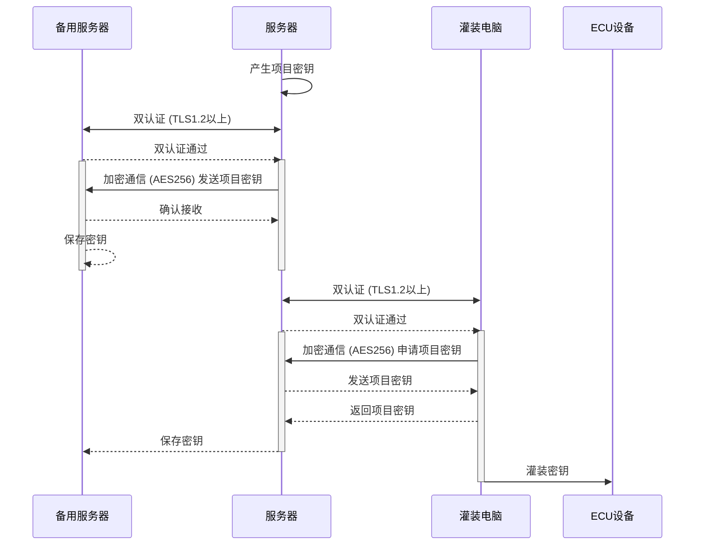

```mermaid
sequenceDiagram
    participant B as 备用服务器
    participant A as 服务器
    participant C as 灌装电脑
    participant D as ECU设备

    A->>A: 产生项目密钥
    A<<->>B: 双认证 (TLS1.2以上)
    B-->>A: 双认证通过
    activate A
    activate B
    A->>B: 加密通信 (AES256) 发送项目密钥
    B-->>A: 确认接收
    B-->>B: 保存密钥
    deactivate B
    deactivate A

    C<<->>A: 双认证 (TLS1.2以上)
    A-->>C: 双认证通过
    activate C
    activate A
    C->>A: 加密通信 (AES256) 申请项目密钥
    A-->>C: 发送项目密钥
    C-->>A: 返回项目密钥
    A-->>B: 保存密钥
    deactivate A
    C->>D: 灌装密钥
    deactivate C

```