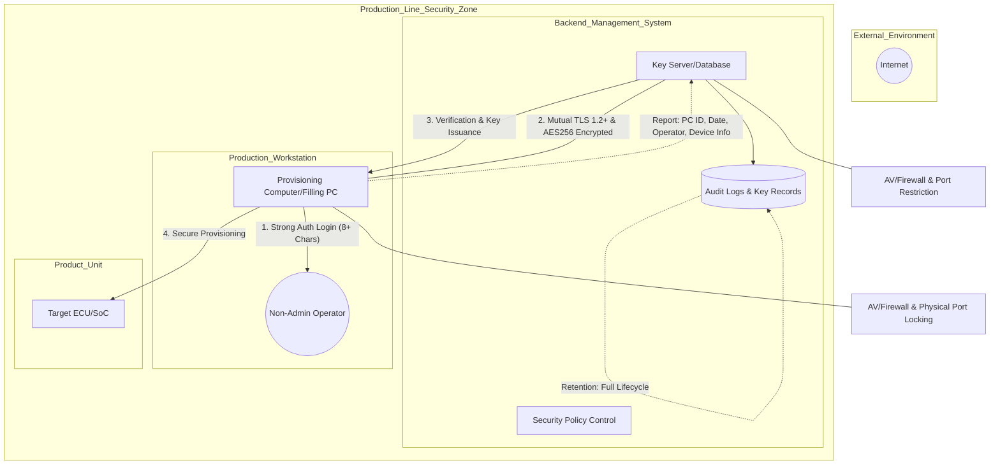

```mermaid
graph TD
    subgraph "External_Environment"
        Internet(("Internet"))
    end

    subgraph "Production_Line_Security_Zone"
        subgraph "Backend_Management_System"
            Server["Key Server/Database"]
            LogDB[("Audit Logs & Key Records")]
            AdminPolicy[Security Policy Control]
        end

        subgraph "Production_Workstation"
            PC["Provisioning Computer/Filling PC"]
            User(("Non-Admin Operator"))
        end

        subgraph "Product_Unit"
            ECU["Target ECU/SoC"]
        end
    end

    %% Security Controls
    
    PC -- "1. Strong Auth Login (8+ Chars)" --> User
    PC -- "2. Mutual TLS 1.2+ & AES256 Encrypted" --- Server
    
    Server -- "3. Verification & Key Issuance" --> PC
    PC -- "4. Secure Provisioning" --> ECU
    
    %% ISO 21434 Traceability
    PC -. "Report: PC ID, Date, Operator, Device Info" .-> Server
    Server --> LogDB
    LogDB -. "Retention: Full Lifecycle" .-> LogDB

    %% Physical & System Hardening
    Server --- Hardening1["AV/Firewall & Port Restriction"]
    PC --- Hardening2["AV/Firewall & Physical Port Locking"]
```