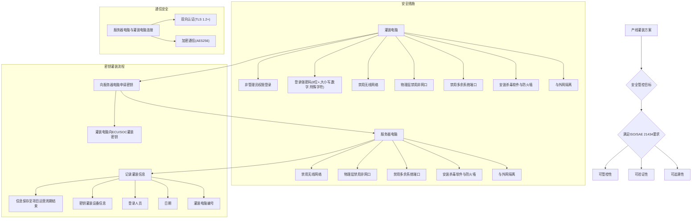

```mermaid
graph TD
    A[产线灌装方案] --> B{安全管控目标};
    B --> C{"满足ISO/SAE 21434要求"};

    C --> C1[可追溯性];
    C --> C2[可验证性];
    C --> C3[可管控性];

    subgraph "安全措施"
        D[服务器电脑] --> D1[与外网隔离];
        D --> D2[安装杀毒软件与防火墙];
        D --> D3[禁用多余系统端口];
        D --> D4[物理层禁用非网口];
        D --> D5[禁用无线网络];

        E[灌装电脑] --> E1[与外网隔离];
        E --> E2[安装杀毒软件与防火墙];
        E --> E3[禁用多余系统端口];
        E --> E4[物理层禁用非网口];
        E --> E5[禁用无线网络];
        E --> E6["登录强密码(8位+,大小写,数字,特殊字符)"];
        E --> E7[非管理员权限登录];
    end

    subgraph "通信安全"
        F[服务器电脑与灌装电脑连接] --> F1["双向认证(TLS 1.2+)"];
        F --> F2["加密通信(AES256)"];
    end

    subgraph "密钥灌装流程"
        E --> G[向服务器电脑申请密钥];
        G --> D;
        D --> H[记录灌装信息];
        H --> H1[灌装电脑编号];
        H --> H2[日期];
        H --> H3[登录人员];
        H --> H4[密钥灌装设备信息];
        H --> H5[信息保存至项目运营周期结束];
        G --> I["灌装电脑向ECU/SOC灌装密钥"];
    end

```