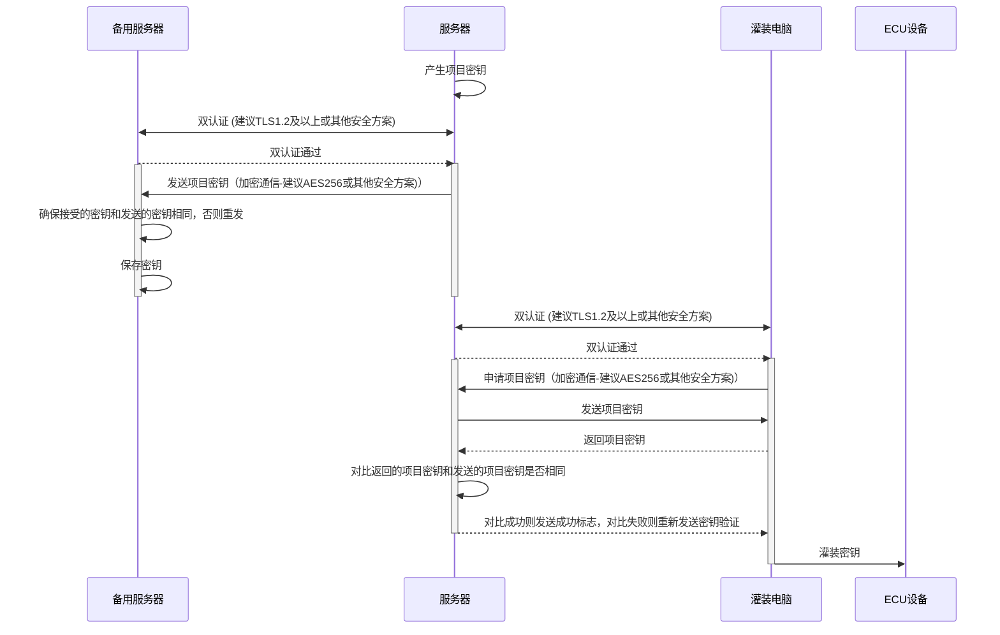

```mermaid
sequenceDiagram
    participant B as 备用服务器
    participant A as 服务器
    participant C as 灌装电脑
    participant D as ECU设备

    A->>A: 产生项目密钥
    A<<->>B: 双认证 (建议TLS1.2及以上或其他安全方案)
    B-->>A: 双认证通过
    activate A
    activate B
    A->>B: 发送项目密钥（加密通信-建议AES256或其他安全方案)）

    B->>B: 确保接受的密钥和发送的密钥相同，否则重发
    B->>B: 保存密钥
    deactivate B
    deactivate A

    C<<->>A: 双认证 (建议TLS1.2及以上或其他安全方案)
    A-->>C: 双认证通过
    activate C
    activate A
    C->>A: 申请项目密钥（加密通信-建议AES256或其他安全方案)）
    A->>C: 发送项目密钥
    C-->>A: 返回项目密钥
    A->>A: 对比返回的项目密钥和发送的项目密钥是否相同
    A-->>C: 对比成功则发送成功标志，对比失败则重新发送密钥验证
    deactivate A
    C->>D: 灌装密钥
    deactivate C

```