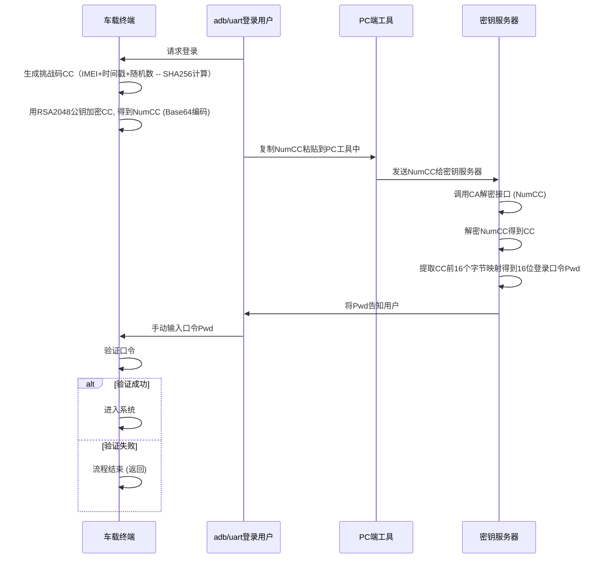

```mermaid
sequenceDiagram
    participant tbox as 车载终端
    participant user as adb/uart登录用户
    participant pc as PC端工具
    participant tech_center as 密钥服务器
  

    user->>tbox: 请求登录
    tbox->>tbox: 生成挑战码CC（IMEI+时间戳+随机数 -- SHA256计算）
    tbox->>tbox: 用RSA2048公钥加密CC, 得到NumCC (Base64编码)
    user->>pc: 复制NumCC粘贴到PC工具中
    pc->>tech_center: 发送NumCC给密钥服务器
    tech_center->>tech_center: 调用CA解密接口 (NumCC)
    tech_center->>tech_center: 解密NumCC得到CC
    tech_center->>tech_center: 提取CC前16个字节映射得到16位登录口令Pwd
    tech_center->>user: 将Pwd告知用户
    user->>tbox: 手动输入口令Pwd
    tbox->>tbox: 验证口令
    alt 验证成功
        tbox->>tbox: 进入系统
    else 验证失败
        tbox->>tbox: 流程结束 (返回)
    end


```