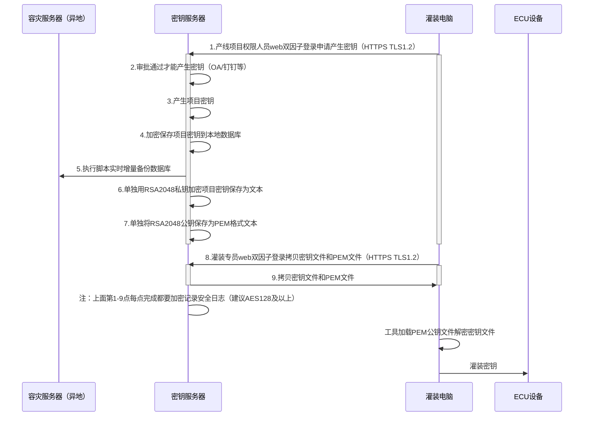

```mermaid
sequenceDiagram
    participant A as 容灾服务器（异地）
    participant B as 密钥服务器
    participant D as 灌装电脑
    participant E as ECU设备

    
    D->>B: 1.产线项目权限人员web双因子登录申请产生密钥（HTTPS TLS1.2）
    activate B
    activate D
    B->>B: 2.审批通过才能产生密钥（OA/钉钉等）
    B->>B: 3.产生项目密钥
    B->>B: 4.加密保存项目密钥到本地数据库
    B->>A: 5.执行脚本实时增量备份数据库
    B->>B: 6.单独用RSA2048私钥加密项目密钥保存为文本
    B->>B: 7.单独将RSA2048公钥保存为PEM格式文本
    deactivate B
    deactivate D

    
    D->>B: 8.灌装专员web双因子登录拷贝密钥文件和PEM文件（HTTPS TLS1.2）
    activate B
    activate D
    B->>D: 9.拷贝密钥文件和PEM文件
    deactivate B
    deactivate D
    B->B: 注：上面第1-9点每点完成都要加密记录安全日志（建议AES128及以上）

    D->>D:工具加载PEM公钥文件解密密钥文件
    
    D->>E: 灌装密钥
```