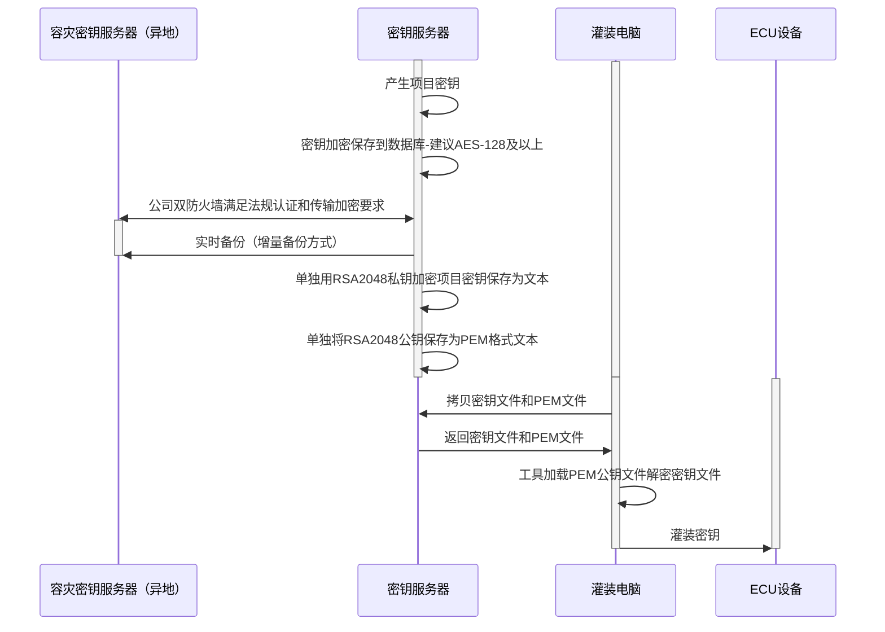

```mermaid
sequenceDiagram
    participant A as 容灾密钥服务器（异地）
    participant B as 密钥服务器
    participant D as 灌装电脑
    participant E as ECU设备

    activate B
    activate D
    B->>B: 产生项目密钥
    B->>B: 密钥加密保存到数据库-建议AES-128及以上
    A<<->>B: 公司双防火墙满足法规认证和传输加密要求

    activate A
    B->>A: 实时备份（增量备份方式）
    deactivate A
    B->>B: 单独用RSA2048私钥加密项目密钥保存为文本
    B->>B: 单独将RSA2048公钥保存为PEM格式文本
    deactivate B
    deactivate D
    

    activate D
    activate E

    D->>B: 拷贝密钥文件和PEM文件
    B->>D: 返回密钥文件和PEM文件
    D->>D:工具加载PEM公钥文件解密密钥文件
    D->>E: 灌装密钥
    deactivate D
    deactivate E

```