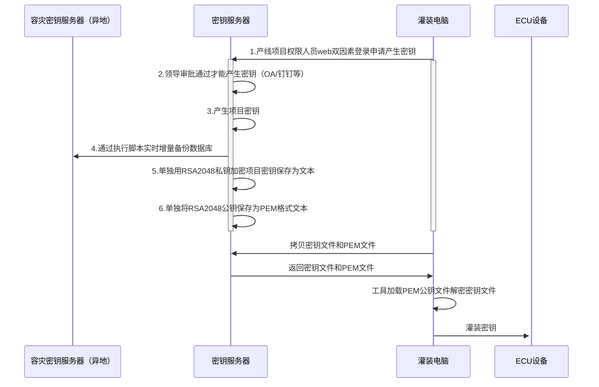

```mermaid
sequenceDiagram
    participant A as 容灾密钥服务器（异地）
    participant B as 密钥服务器
    participant D as 灌装电脑
    participant E as ECU设备

    
    D->>B: 1.产线项目权限人员web双因素登录申请产生密钥
    activate B
    activate D
    B->>B: 2.领导审批通过才能产生密钥（OA/钉钉等）
    B->>B: 3.产生项目密钥
    B->>A: 4.通过执行脚本实时增量备份数据库
    B->>B: 5.单独用RSA2048私钥加密项目密钥保存为文本
    B->>B: 6.单独将RSA2048公钥保存为PEM格式文本
    deactivate B
    deactivate D

    
    D->>B: 拷贝密钥文件和PEM文件
    B->>D: 返回密钥文件和PEM文件
    D->>D:工具加载PEM公钥文件解密密钥文件
    activate E
    D->>E: 灌装密钥
```