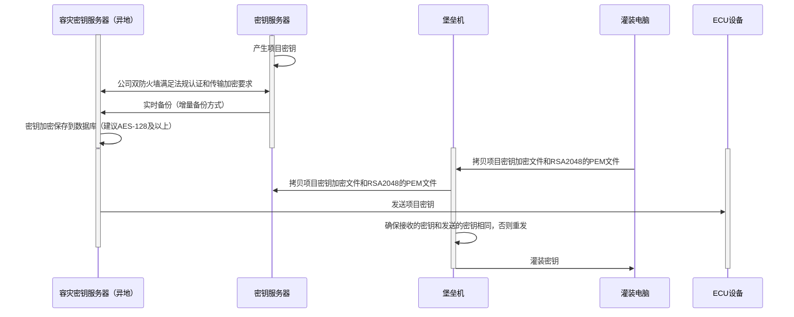

```mermaid
sequenceDiagram
    participant A as 容灾密钥服务器（异地）
    participant B as 密钥服务器
    participant C as 堡垒机
    participant D as 灌装电脑
    participant E as ECU设备

    activate A
    activate B
    B->>B: 产生项目密钥
    A<<->>B: 公司双防火墙满足法规认证和传输加密要求
    B->>A: 实时备份（增量备份方式）
    A->>A: 密钥加密保存到数据库（建议AES-128及以上）
    deactivate B
    deactivate A

    activate C
    activate A
    activate E

    D->>C: 拷贝项目密钥加密文件和RSA2048的PEM文件
    C->>B: 拷贝项目密钥加密文件和RSA2048的PEM文件

    A->>E: 发送项目密钥

    C->>C: 确保接收的密钥和发送的密钥相同，否则重发
    deactivate A
    C->>D: 灌装密钥
    deactivate C
    deactivate E

```