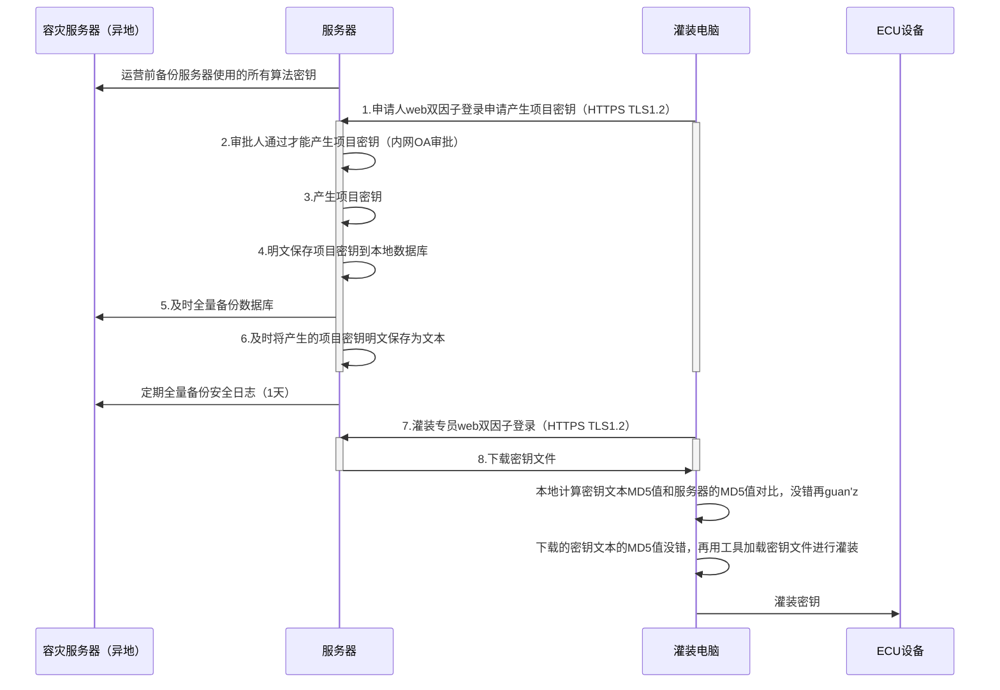

```mermaid
sequenceDiagram
    participant A as 容灾服务器（异地）
    participant B as 服务器
    participant D as 灌装电脑
    participant E as ECU设备

    B->>A: 运营前备份服务器使用的所有算法密钥
    D->>B: 1.申请人web双因子登录申请产生项目密钥（HTTPS TLS1.2）
    activate B
    activate D
    B->>B: 2.审批人通过才能产生项目密钥（内网OA审批）
    B->>B: 3.产生项目密钥
    B->>B: 4.明文保存项目密钥到本地数据库
    B->>A: 5.及时全量备份数据库
    B->>B: 6.及时将产生的项目密钥明文保存为文本
    deactivate B
    deactivate D

    B->>A: 定期全量备份安全日志（1天）
    
    D->>B: 7.灌装专员web双因子登录（HTTPS TLS1.2）
    activate B
    activate D
    B->>D: 8.下载密钥文件
    deactivate B
    deactivate D

    D->>D:本地计算密钥文本MD5值和服务器的MD5值对比，没错再guan'z
    D->>D:下载的密钥文本的MD5值没错，再用工具加载密钥文件进行灌装
    
    D->>E: 灌装密钥
```