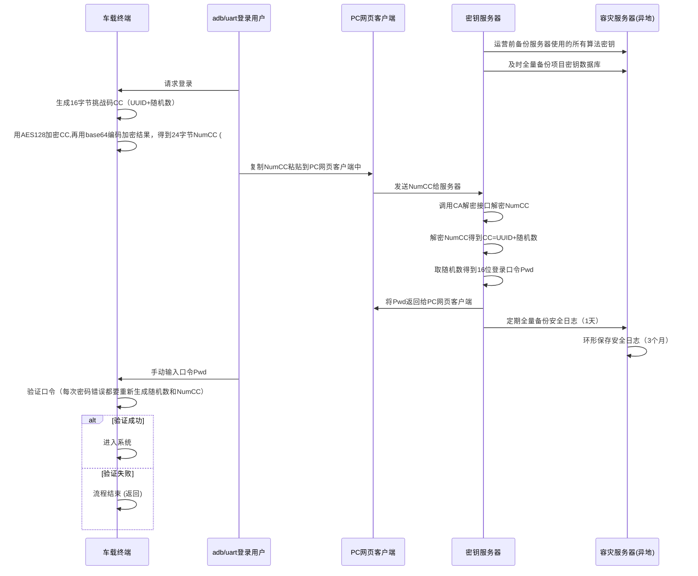

```mermaid
sequenceDiagram
    participant tbox as 车载终端
    participant user as adb/uart登录用户
    participant pc as PC网页客户端
    participant tech_center as 密钥服务器
    participant backup as 容灾服务器(异地)
  
    tech_center->>backup: 运营前备份服务器使用的所有算法密钥
    tech_center->>backup: 及时全量备份项目密钥数据库

    user->>tbox: 请求登录
    tbox->>tbox: 生成16字节挑战码CC（UUID+随机数）
    tbox->>tbox: 用AES128加密CC,再用base64编码加密结果，得到24字节NumCC (
    user->>pc: 复制NumCC粘贴到PC网页客户端中
    pc->>tech_center: 发送NumCC给服务器
    tech_center->>tech_center: 调用CA解密接口解密NumCC
    tech_center->>tech_center: 解密NumCC得到CC=UUID+随机数
    tech_center->>tech_center: 取随机数得到16位登录口令Pwd
    tech_center->>pc: 将Pwd返回给PC网页客户端

    tech_center->>backup: 定期全量备份安全日志（1天）
    backup->>backup: 环形保存安全日志（3个月）
    user->>tbox: 手动输入口令Pwd
    tbox->>tbox: 验证口令（每次密码错误都要重新生成随机数和NumCC）
    alt 验证成功
        tbox->>tbox: 进入系统
    else 验证失败
        tbox->>tbox: 流程结束 (返回)
    end


```