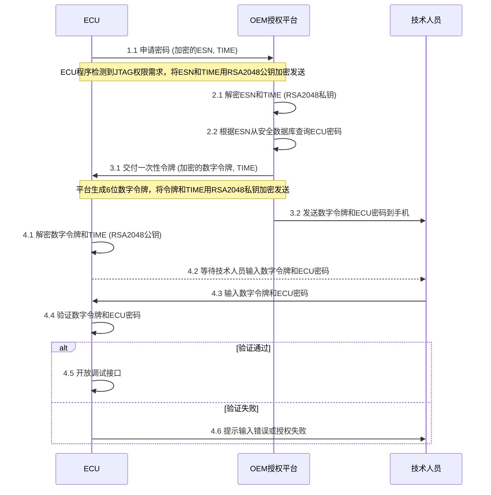

```mermaid
sequenceDiagram
    participant ECU
    participant OEM授权平台
    participant 技术人员

    ECU->>OEM授权平台: 1.1 申请密码 (加密的ESN, TIME)
    Note over ECU,OEM授权平台: ECU程序检测到JTAG权限需求，将ESN和TIME用RSA2048公钥加密发送
    OEM授权平台->>OEM授权平台: 2.1 解密ESN和TIME (RSA2048私钥)
    OEM授权平台->>OEM授权平台: 2.2 根据ESN从安全数据库查询ECU密码
    OEM授权平台->>ECU: 3.1 交付一次性令牌 (加密的数字令牌, TIME)
    Note over OEM授权平台,ECU: 平台生成6位数字令牌，将令牌和TIME用RSA2048私钥加密发送
    OEM授权平台->>技术人员: 3.2 发送数字令牌和ECU密码到手机
    ECU->>ECU: 4.1 解密数字令牌和TIME (RSA2048公钥)
    ECU-->>技术人员: 4.2 等待技术人员输入数字令牌和ECU密码
    技术人员->>ECU: 4.3 输入数字令牌和ECU密码
    ECU->>ECU: 4.4 验证数字令牌和ECU密码
    alt 验证通过
        ECU->>ECU: 4.5 开放调试接口
    else 验证失败
        ECU->>技术人员: 4.6 提示输入错误或授权失败
    end

```