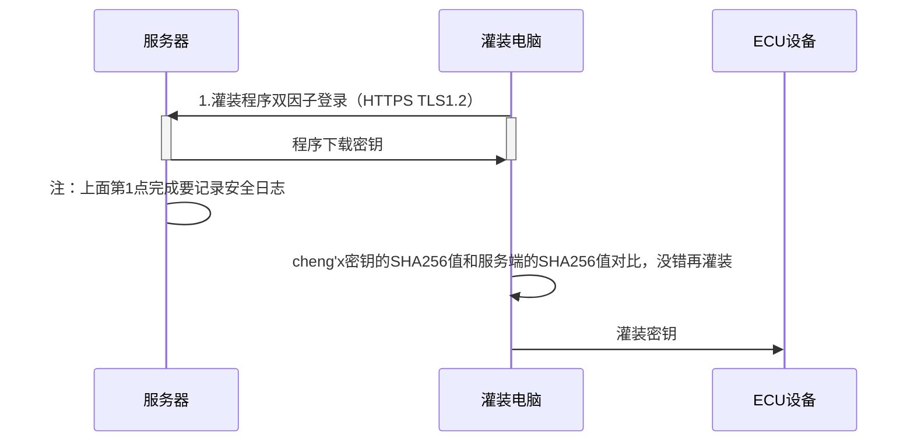

```mermaid
sequenceDiagram
  
    participant B as 服务器
    participant D as 灌装电脑
    participant E as ECU设备

    D->>B: 1.灌装程序双因子登录（HTTPS TLS1.2）
    activate B
    activate D
    B->>D: 程序下载密钥
    deactivate B
    deactivate D
    B->B: 注：上面第1点完成要记录安全日志

    D->>D:cheng'x密钥的SHA256值和服务端的SHA256值对比，没错再灌装
    
    D->>E: 灌装密钥
```