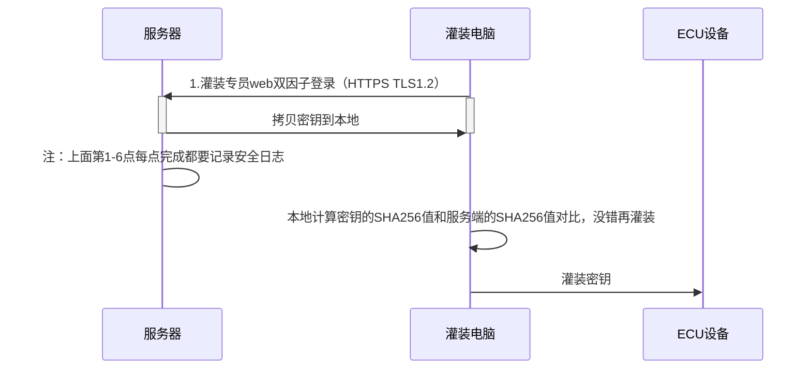

```mermaid
sequenceDiagram
  
    participant B as 服务器
    participant D as 灌装电脑
    participant E as ECU设备

    D->>B: 1.灌装专员web双因子登录（HTTPS TLS1.2）
    activate B
    activate D

    B->>D: 拷贝密钥到本地
    deactivate B
    deactivate D
    B->B: 注：上面第1-6点每点完成都要记录安全日志

    D->>D:本地计算密钥的SHA256值和服务端的SHA256值对比，没错再灌装
    
    D->>E: 灌装密钥
```