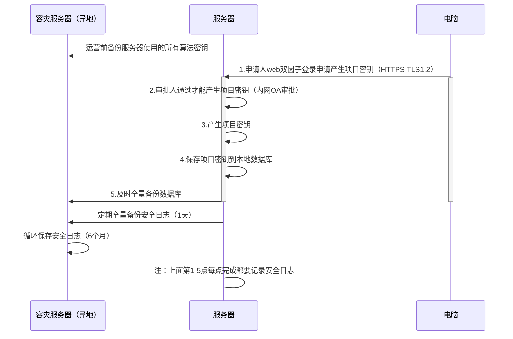

```mermaid
sequenceDiagram
    participant A as 容灾服务器（异地）
    participant B as 服务器
    participant D as 电脑

    B->>A: 运营前备份服务器使用的所有算法密钥
    D->>B: 1.申请人web双因子登录申请产生项目密钥（HTTPS TLS1.2）
    activate B
    activate D
    B->>B: 2.审批人通过才能产生项目密钥（内网OA审批）
    B->>B: 3.产生项目密钥
    B->>B: 4.保存项目密钥到本地数据库
    B->>A: 5.及时全量备份数据库

    deactivate B
    deactivate D

    B->>A: 定期全量备份安全日志（1天）
    A->>A: 循环保存安全日志（6个月）
    
    B->B: 注：上面第1-5点每点完成都要记录安全日志

    

```