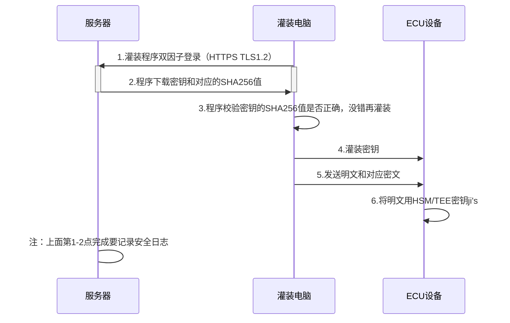

```mermaid
sequenceDiagram
  
    participant B as 服务器
    participant D as 灌装电脑
    participant E as ECU设备

    D->>B: 1.灌装程序双因子登录（HTTPS TLS1.2）
    activate B
    activate D

    B->>D: 2.程序下载密钥和对应的SHA256值 

    deactivate B
    deactivate D
    
    D->>D: 3.程序校验密钥的SHA256值是否正确，没错再灌装
    D->>E: 4.灌装密钥
    D->>E: 5.发送明文和对应密文
    E->>E: 6.将明文用HSM/TEE密钥ji's

    B->B: 注：上面第1-2点完成要记录安全日志
```