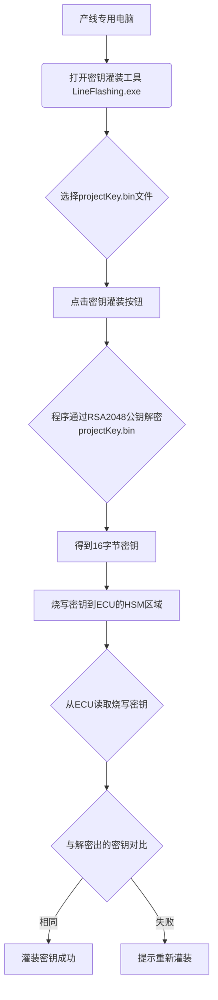

```mermaid
graph TD
    A[产线专用电脑] --> B(打开密钥灌装工具 LineFlashing.exe);
    B --> C{选择projectKey.bin文件};
    C --> D[点击密钥灌装按钮];
    D --> E{程序通过RSA2048公钥解密projectKey.bin};
    E --> F[得到16字节密钥];
    F --> G[烧写密钥到ECU的HSM区域];
    G --> H{从ECU读取烧写密钥};
    H --> I{与解密出的密钥对比};
    I -- 相同 --> J[灌装密钥成功];
    I -- 失败 --> K[提示重新灌装];

```