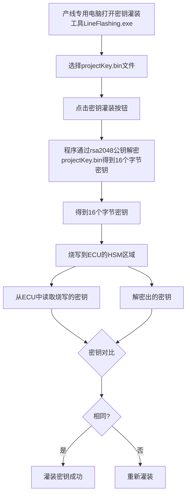

```mermaid
graph TD
    A[产线专用电脑打开密钥灌装工具LineFlashing.exe] --> B[选择projectKey.bin文件]
    B --> C[点击密钥灌装按钮]
    C --> D[程序通过rsa2048公钥解密projectKey.bin得到16个字节密钥]
    D --> E[得到16个字节密钥]
    E --> F[烧写到ECU的HSM区域]
    F --> G[从ECU中读取烧写的密钥]
    F --> H[解密出的密钥]
    G --> I{密钥对比}
    H --> I
    I --> J{相同?}
    J -- 是 --> K[灌装密钥成功]
    J -- 否 --> L[重新灌装]

```