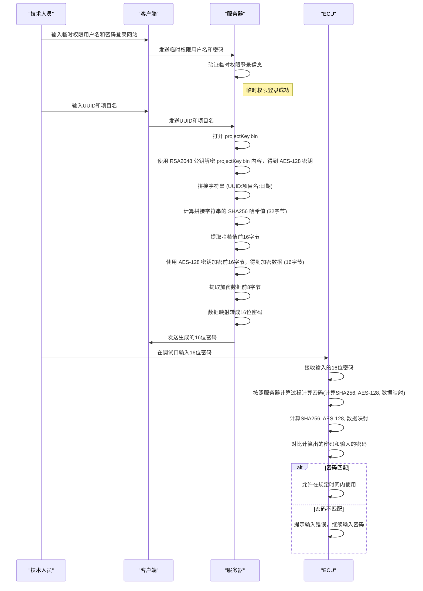

```mermaid
sequenceDiagram
    participant Technician as "技术人员"
    participant Client as "客户端"
    participant Server as "服务器"
    participant ECU as "ECU"

    Technician->>Client: 输入临时权限用户名和密码登录网站
    Client->>Server: 发送临时权限用户名和密码

    Server->>Server: 验证临时权限登录信息
    Note right of Server: 临时权限登录成功

    Technician->>Client: 输入UUID和项目名
    Client->>Server: 发送UUID和项目名

    Server->>Server: 打开 projectKey.bin
    Server->>Server: 使用 RSA2048 公钥解密 projectKey.bin 内容，得到 AES-128 密钥

    Server->>Server: 拼接字符串 (UUID:项目名:日期)
    Server->>Server: 计算拼接字符串的 SHA256 哈希值 (32字节)
    Server->>Server: 提取哈希值前16字节
    Server->>Server: 使用 AES-128 密钥加密前16字节，得到加密数据 (16字节)
    Server->>Server: 提取加密数据前8字节
    Server->>Server: 数据映射转成16位密码

    Server->>Client: 发送生成的16位密码

    Technician->>ECU: 在调试口输入16位密码

    ECU->>ECU: 接收输入的16位密码
    ECU->>ECU: 按照服务器计算过程计算密码(计算SHA256, AES-128, 数据映射)
    ECU->>ECU: 计算SHA256, AES-128, 数据映射

    ECU->>ECU: 对比计算出的密码和输入的密码
    alt 密码匹配
        ECU->>ECU: 允许在规定时间内使用
    else 密码不匹配
        ECU->>ECU: 提示输入错误，继续输入密码
    end

```