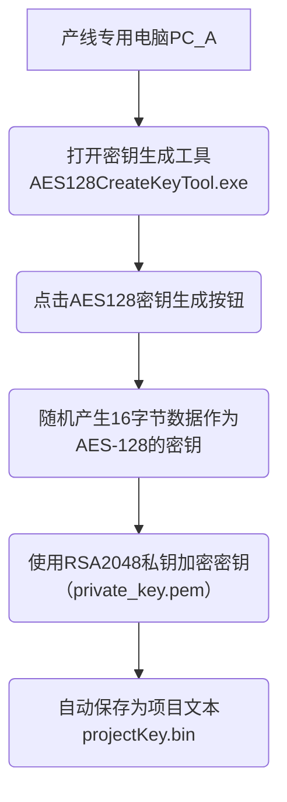

```mermaid
graph TD
    A[产线专用电脑PC_A] --> B(打开密钥生成工具AES128CreateKeyTool.exe)
    B --> C(点击AES128密钥生成按钮)
    C --> D(随机产生16字节数据作为AES-128的密钥)
    D --> E(使用RSA2048私钥加密密钥（private_key.pem）)
    E --> F(自动保存为项目文本projectKey.bin)

```