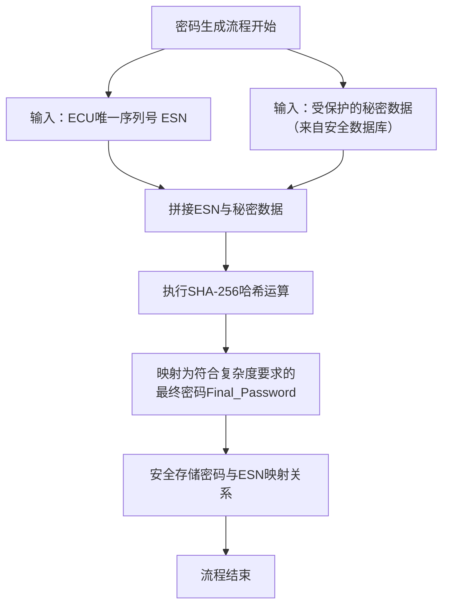

```mermaid
flowchart TD
    Start[密码生成流程开始] --> Input_ESN[输入：ECU唯一序列号 ESN]
    Start --> Input_Secret[输入：受保护的秘密数据<br>（来自安全数据库）]

    Input_ESN --> Concatenate[拼接ESN与秘密数据]
    Input_Secret --> Concatenate

    Concatenate --> Hash[执行SHA-256哈希运算]
    Hash --> Map[映射为符合复杂度要求的<br>最终密码Final_Password]
    Map --> Store[安全存储密码与ESN映射关系]
    Store --> End[流程结束]
```